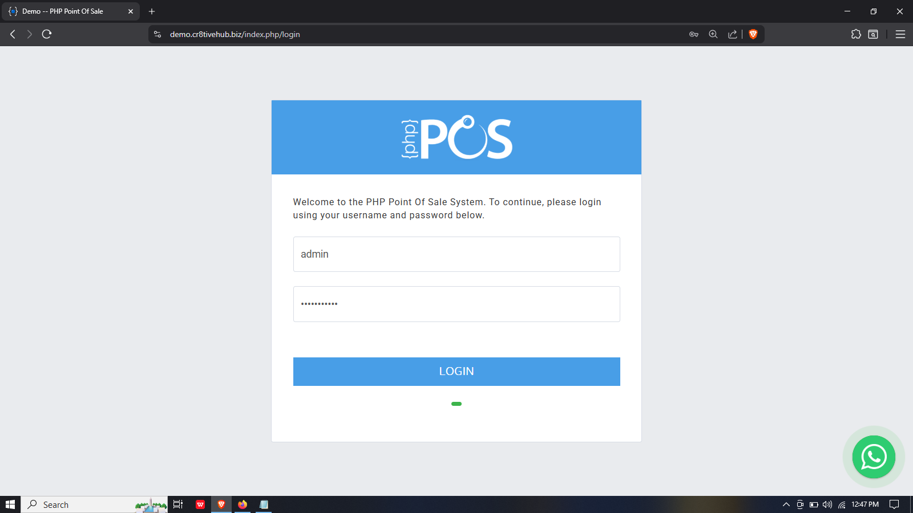
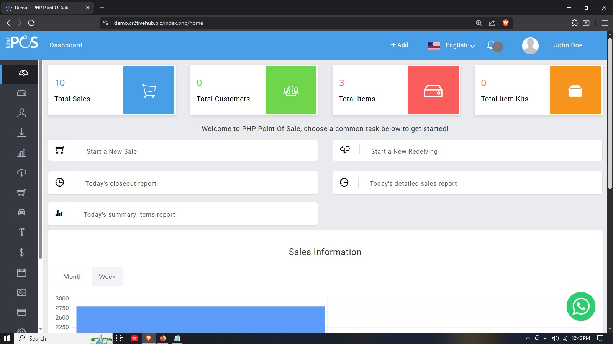

# PHP-Point-Of-Sale-Source-Code
‎PHP Point of Sale is designed to streamline sales and inventory management processes for various businesses. It helps track customers, items, and sales reports, and allows you to print receipts.
‎
Demo link: https://youtu.be/vFgXbMbpMNc or https://phppointofsale.com.ng

WhatsApp: https://wa.me/+2348030732445

Telegram: https://t.me/cr8tivehub

‎The software is available on Windows, Mac, Linux, and as a source code.
